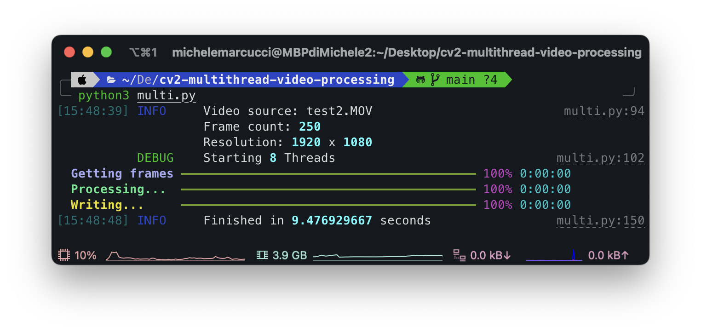

# OpenCV Multithread video processing



Used in this project: [SkinDetection](https://github.com/mik3sw/SkinDetection)

## (Very) Quick start
You have to modify this function in ```multy.py```:

```python
from my_file import my_function

def do_sth(frame):
    # here put your function
    new_frame = my_function(frame[0])
    # new_frame = cv2.flip(frame[0], 0)
    
    final.put((new_frame, frame[1]))
    bar.update(task, advance=1)
    time.sleep(0.1)
```
By default i used a cv function thath flip the frame.

* ```frame[0]``` is a cv2 image 
* ```my_function()``` must return a cv2 image

You can use a main.py file like this:

```python
import multi

filename = "test.mp4"
multi.init(filename)

# will save a "test_processed.mp4" file

```

## END